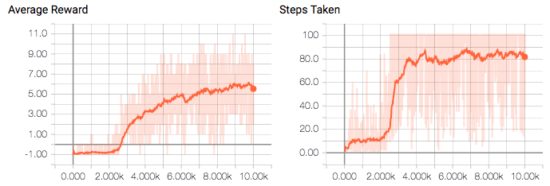

# Slitherin'
OpenAi requests for research.

<!---
## Visualization
The snake is blue: (0,0,255), but its head is slighly darker (0,0,127).
The barrier is red: (255,0,0)
The food is green: (0,255,0)

--->

## Replication

To replicate: Clone the directory and follow the following:
~~~
pip install gym
cd /dir/RL_Algos/gym-snake
pip install -e .
cd /dir/RL_Algos/research/slitherin
pip install -e .
python train_simple.py --iterations 10000 -seq 100 --animate -gpe 1 -bpe 1 -b 64 -uf 500 -bs 100000 --seed 3  -hless
python train_single.py --iterations 10000 -seq 200 --animate -gpe 1 -bpe 1 -b 128 -uf 500 -bs 100000 --seed 5 -hless
~~~
*Make sure you you specify the correct directory for /dir/*

## 2 Snake

Currently under work in the two_snake branch. TBA.

My progress so far has been in implementing NFSP (https://arxiv.org/pdf/1603.01121.pdf) which have achieved the following results:

,,

My next thought to overcome instability is to make a main snake which learns while the other has a previous version of the main snake's weights, hence a weaker snake, updated every N iterations. This is slightly different than NFSP since in NFSP both snakes are learning a Nash equilibrium, while here the snake is learning to beat the previous best version of itself.

## 1 Snake

I tried two different representations (preprocessing) for the 1 snake scenario: one that is natural and one less so but arguably more generalizable. My reinforcement learning algorithm of choice was Double DQN in both.

### Natural
*Note: all of the matrices shown are rotated by 90 degrees around the center of the matrix so that they match the images. In reality (in system memory), they are in unrotated form.*

I chose to start here as a baseline and make sure my implementation was correct, since I knew that this task was solvable given the Atari results combining CNN and DQN. Take the SnakeWorld exactly as rendered, then make it grayscale. In other words, consider the rendering of the SnakeWorld is:

 
*Note the colors: head is (0,0,127), while the body is (0,0,255)*

This state is given by an RGB array of size (3, 8, 8) representing (channels, height, width).

<!---
|255|255|255|255|255|255|255|255|
|--|--|--|--|--|--|--|--|
|255|0 |0 |0 |0 |0 |0 |255|
|255|0 |0 |0 |0 |0 |0 |255|
|255|0 |0 |0 |0 |0 |0 |255|
|255|0 |0 |0 |0 |0 |0 |255|
|255|0 |0 |0 |0 |0 |0 |255|
|255|0 |0 |0 |0 |0 |0 |255|
|255|255|255|255|255|255|255|255|

|0|0|0|0|0|0|0|0|
|--|--|--|--|--|--|--|--|
|0|0 |0 |0 |0 |0 |0 |0|
|0|0 |0 |0 |0 |0 |0 |0|
|0|0 |0 |0 |0 |0 |0 |0|
|0|0 |0 |0 |0 |0 |0 |0|
|0|0 |0 |0 |0 |0 |255 |0|
|0|0 |0 |0 |0 |0 |0 |0|
|0|0|0|0|0|0|0|0|

|0|0|0|0|0|0|0|0|
|--|--|--|--|--|--|--|--|
|0|0 |0 |0 |0 |0 |0 |0|
|0|0 |255 |0 |0 |0 |0 |0|
|0|0 |255 |0 |0 |0 |0 |0|
|0|0 |255 |0 |0 |0 |0 |0|
|0|0 |255 |255 |127 |0 |0 |0|
|0|0 |0 |0 |0 |0 |0 |0|
|0|0|0|0|0|0|0|0|
--->

Then I convert this to grayscale via the formula gray(R,G,B) = 0.299*R + 0.587*G + 0.114B, achieving:

|.299|.299|.299|.299|.299|.299|.299|.299|
|--|--|--|--|--|--|--|--|
|.299|0 |0 |0 |0 |0 |0 |.299|
|.299|0 |.114 |0 |0 |0 |0 |.299|
|.299|0 |.114 |0 |0 |0 |0 |.299|
|.299|0 |.114 |0 |0 |0 |0 |.299|
|.299|0 |.114 |.114 |.057 |0 |.587 |.299|
|.299|0 |0 |0 |0 |0 |0 |.299|
|.299|.299|.299|.299|.299|.299|.299|.299|

I use the following neural network and hyperparameters

 **Using Leaky Relu activations**

|Param                                              | Number| Description      |
|---------------------------------------------------|-------|------------------|
|Iterations                                         |  10000| Number of full games to play|
|Batch Size                                         |  64   | Mini-batch size for NN|
|Update Frequency                                   |  500  | How often to update target network |
|Double DQN?                                        |  True | Whether or not to use double dqn|
|Prioritized Experience Replay?                     |  False| Whether or not to use a prioritized buffer|
|Buffer Size                                        |  50000| Number of frames stored in the buffer |
|Gamma                                              |  .99  | Factor which prioritizes shorter term rewards |
|Gradient Clip                                      |  None | Maximum gradient allowable|
|Batches per batches                                |  1    | How many minibatches per train step|
|Max epsilon                                        |  1.0  | Probability with which to take random action|
|Min epsilon                                        |  .01  | Probability with which to take random action|
|Epsilon num_steps                                  |  9000 | The number of steps to linearly interpolate between max/min epsilon|
|Start Train t                                      |  25000| How many frames to add to buffer before starting training|
|Frames between learning steps                      |  4    | Number of frames added to buffer between training steps|
|Min learning steps per iteration                   |  unset| Make sure this number of training steps occurs per iteration|
|Max learning steps per iteration                   |  unset| Make sure no more than this number of training steps occurs per iteration|
|Maximum number of steps                            |  100  | Number of steps the snake can take before episode completion|    

|Number of steps                                    | Learning Rate|
|---------------------------------------------------|--------------|
| 0                                                 |   1e-3       |
| 20000                                             |   5e-3       |
| 50000                                             |   1e-4       |

Setting seed=3, I yield the following curves:

Visualizing learning over time:

| Game        | 2500 | 5500      | Post Learning|   
|-------------|------|-----------|--------------|
| ||||
| Frames Seen | 672k | 4300k     | 10000k		     |
| Epsilon     | .75  | .42       | 0 			        | 
| Steps taken | 8    | 100 (max) | 300+ (unbounded)	|
| Food Eaten  | 0    | 5         | 9   			      |

Notice that after 5500 iterations, the snake does well at avoiding walls, but ends itself in an (seemingly) infinite loop around the food.
Similarly, after 10000 interations (post learning) the snake has learned that eating some food is good, but eventually finds itself doing infinite loops near the wall.
This is due to incomplete training; once the snake gets too long it recognizes that it's better to not run into itself than risk getting food and dying.
However, had the snake seen enough samples, it would have been able to get beyond this quirky behavior. This is, probably, most of the reason that reward flattens out over time. This motivated me to implement prioritized experience replay, which has been shown before to place priority on samples which improve the model the most rather than hoping to learn through random sampling (which works in expectation, but could take forever), in the next 1 snake case.

### More generalizable
*Note: all of the matrices shown are rotated by 90 degrees around the center of the matrix so that they match the images. In reality (in system memory), they are in unrotated form.*

While before I converted the RGB state of the world to grayscale and used that, here I do something that generalizes beyond color and will (in my hope) work well in describing multi-snake state:

Consider the rendering of the SnakeWorld as:

 

The state is given by a list of sparse array of shape (8, 8).

**The odd channel(s) is:**  
  * -1 for boundary
  * 1 for snake body (including head)
  * 0 otherwise

**The even channel(s) is:**  
  * -1 for boundary
  * 1 for snake head (excluding rest of body)
  * 0 otherwise

**The last channel is:**  
  * -1 for boundary
  * 1 for food
  * 0 otherwise
  
Hence, for our example, we'd have a list of (but in their sparse form, rather):

,,

*Note: sparsity is to conserve system memory in case memory is scarce*

In the 1 snake case, the list is then of shape (3,8,8). However in the multi-snake case, it's (2*number of snakes + 1, 8,8), taking the form (Snake 1 body, Snake 1 head,..., Snake N body, Snake N head, food).

I believe this will generalize better to multi-snake scenarios because the network need not learn anything about color/grayscale and can rely solely on the presence or absence of a snake, allowing multiple snakes to be represented by adding additional channels using the same stucture.

I use the following neural network and hyperparameters

 **Using Leaky Relu activations**

|Param                                            | Number| Description      |
|-------------------------------------------------|-------|------------------|
|Iterations                                       |  10000| Number of full games to play|
|Batch Size                                       |  128  | Mini-batch size for NN|
|Update Frequency                                 |  500  | How often to update target network |
|Double DQN?                                      |  True | Whether or not to use double dqn|
|Prioritized Experience Replay?  (PER)            |  True | Whether or not to use a prioritized buffer|
|Buffer Size                                      |  50000| Number of frames stored in the buffer |
|Gamma                                            |  .99  | Factor which prioritizes shorter term rewards |
|Gradient Clip                                    |  None | Maximum gradient allowable|
|Batches per batches                              |  1    | How many minibatches per train step|
|Max epsilon                                      |  1.0  | Probability with which to take random action|
|Min epsilon                                      |  .01  | Probability with which to take random action|
|Epsilon num_steps                                |  9500 | The number of steps to linearly interpolate between max/min epsilon|
|Start Train t                                    |  25000| How many frames to add to buffer before starting training|
|Frames between learning steps                    |  4    | Number of frames added to buffer between training steps|
|Min learning steps per iteration                 |  1    | Make sure this number of training steps occurs per iteration|
|Max learning steps per iteration                 |  12   | Make sure no more than this number of training steps occurs per iteration|
|Maximum number of steps                          |  200  | Number of steps the snake can take before episode completion|
|Max beta                                         |  1.0  | Factor to balance out bias due to PER|
|Min beta                                         |  .4   | Factor to balance out bias due to PER|
|Beta number of steps                             | 50000 | The number of steps to linearly interpolate between max/min beta|
|Alpha                                            | .5    | Interpolation between greedy and uniform prioritization for PER |  
|Alpha epsilon                                    | 1e-8  | A small number to make sure probabilities are non-zero for PER |  

|Number of steps                                    | Learning Rate|
|---------------------------------------------------|--------------|
| 0                                                 |   1e-3       |
| 20000                                             |   5e-3       |
| 50000                                             |   1e-4       |

Setting seed=5, I yield the following curves:

Visualizing learning over time:

| Game        | 2500 | 5500  | Post Learning|   
|-------------|------|-------|--------------|
| ||||
| Frames Seen | 1400k | 5700k | 12300k		    |
| Epsilon     | .75  | .42   | 0 			      | 
| Steps taken | 200 (max)    | 62 | 187	|
| Food Eaten  | 0    | 12     | 35 (all) |

Through prioritized experience replay, I achieved some nice results where the snake is able to win the game, even given the input state structure which I believe to be more general than the "natural" way of using color. Notice reward also plateaus in the generalized case as well, but that's because it will asymptotically approach the board-determined max reward of 35 (=(8-2)*(8-2)-1).

